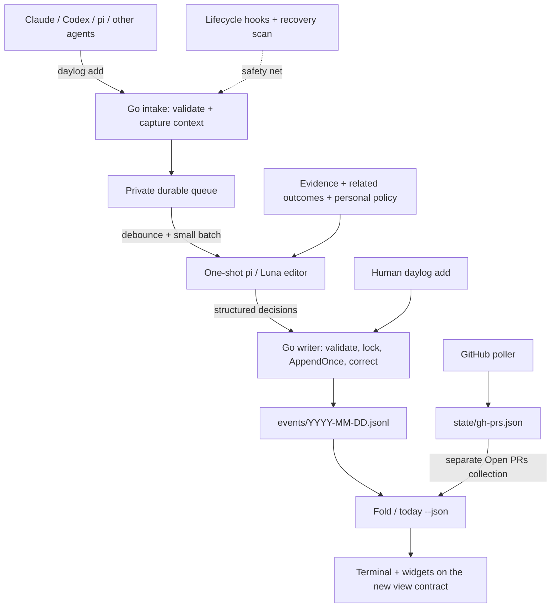

# Athena (daylog gatekeeping): architecture and implementation plan

**Naming:** Athena is the gatekeeping subsystem/module (`internal/athena`), not the model or a persona. References to the editor below describe its model-assisted curation component. `daylog curate` remains the action verb.

- **Status:** v2 implementation through checkpoint 7 is present. On 2026-09-09, seven synthetic Luna policy cases passed; nine real macOS reports were previewed and then freshly evaluated and published with human approval under `athena-v2.2`. One invented reference was rejected, then the activated LaunchAgent successfully retried it. New configs default to live; preview is explicit `--dry-run` without consuming reports. This small sample is not a quality/recall guarantee. Live harness capture and Windows/Linux runtime validation remain unverified.
- **Date:** 2026-09-06
- **Delivery:** one cohesive implementation pass, in the ordered checkpoints below. No PR stack or mandatory week-long rollout. Installation and live publication remain explicit actions.

This is the actionable successor to the [automatic-logging research](automatic-logging-research.md). It changes the first build from hook-first extraction to **report-first editorial control**. The research remains useful background; this document wins on implementation scope and order. The [architecture](../ARCHITECTURE.md) now documents the implemented v2 system and its verification limits; implementation does not enable live publication.

## 1. Decision

**Working agents report what happened. A small pi agent decides what belongs in the journal. Go owns persistence and publication.**

Build a clean gatekeeper-first version. Reuse Go, append-only JSONL, and useful code where they fit; keep the product jobs of human quick-capture, explicit todos, separate GitHub snapshots, and lightweight widgets. Add a local candidate queue and a one-shot pi runner using **`openai-codex/gpt-5.6-luna`**, verified available in the installed pi catalog. Model/provider selection is configurable; speed and editorial quality still need evaluation.

**No backward compatibility is required.** Replace old schemas, CLI contracts, config keys, instruction text, and consumer fields outright when that makes the design cleaner. Ship producers, store/fold, and widgets together against one new contract. Do not build legacy routing, deprecated aliases, dual readers/writers, old-format fallbacks, or a migration framework. Existing code is reusable material, not a compatibility constraint.

Initialize a fresh, explicitly versioned store for the new implementation. If the selected directory already contains unsupported data, refuse to use it and require a fresh location; do not silently convert, mix, overwrite, or delete it. Old history/config can remain archived outside the active store without being readable by the new binary. Importing old records is out of scope.

The working agent no longer has to apply our whole materiality rubric or decide whether an outcome is worth the human's attention. It reports facts, findings, decisions, and changes, including incomplete results honestly. Unnecessary reports are acceptable private inputs, not automatic visible entries. We are not asking it to narrate every tool call.

The gatekeeper is an **editor**, not just a yes/no filter. It can rewrite, combine, update, skip, or hold reports. It does not run another coding investigation, manage the queue, or mutate ledger files.

## 2. Architecture sketch



Hooks are not a second publisher. They supply evidence to the same editor when reporting was forgotten or needs corroboration. Explicit reports are useful semantic hints, not the only reliable capture path. The report-fed vertical slice works before any adapter exists.

### Division of responsibility

| Component | Owns | Does not own |
| --- | --- | --- |
| Working agent | Factual report; attempt/completion distinction; useful refs | Journal relevance, final wording, deduplication |
| Intake and queue | Original context/time, evidence IDs, durability, processing state | Semantic judgment |
| pi/Luna editor | Relevance, supported wording, outcome grouping, proposed edits | Filesystem access, shell, queue state, timestamps, authority to overwrite human choices |
| Go publisher | Schema/target validation, revision checks, replay safety, immutable events | Inventing facts or treating model confidence as proof |
| Human | Explicit notes/todos, corrections, preferences, project approval | Reviewing every candidate |

## 3. CLI behavior and operating modes

The commands below describe the selected v2 contract. See [README](../README.md) for implemented setup and operational instructions; no old interface is preserved.

Use a simple reporting interface:

```sh
daylog add --type work --ref '#142' "Fixed the token-refresh race"
```

For an `agent:*` source, this always captures context, durably enqueues a candidate, and immediately returns **`queued <candidate-id>`**, not `logged`. No model call runs on the producer's critical path. Failed persistence is an explicit error; never pretend that an unqueued report was accepted.

Routing is deliberately narrow:

- Agent `work`, `sidequest`, and `note`: always candidates. No type, mode, missing model, or stopped worker enables direct narrative publication.
- Human narrative entries: direct writes. Human quick-capture is not subject to automated relevance vetoes.
- Explicit agent `todo`: a proposal for the human, not a journal candidate. Liberal narrative reporting must not become liberal todo creation.
- Human commands handle todo adoption/decline/completion and narrative corrections. Consolidate command names where useful; the old `reclassify` command need not survive separately from `amend`. The gatekeeper cannot create, close, or approve obligations.
- Poller snapshots: separate current state; never pass PR/CI status through as work outcomes.

Live curation is the normal path. Preview is an explicit invocation, not a machine-scoped rollout state:

| Invocation | Agent narrative intake | Worker |
| --- | --- | --- |
| `curate --once` / scheduled `tick` | Always queue | Apply validated editorial decisions |
| `curate --once --dry-run` | Always queue | Return preview actions; leave reports unprocessed |

**There is no direct-agent mode or parallel publisher.** Dry runs still invoke the model and count against the budget. Legacy shadow configs remain paused until explicitly resumed; historical shadow plans never auto-publish. New runs do not create shadow plans.

The skill has one instruction set: report facts and distinguish attempted from completed work; the editor handles relevance and grouping. It does not inspect the mode or carry the old materiality rubric. Pause publication by stopping the scheduled worker. Intake keeps queuing and never auto-flushes reports as journal entries.

The first release also exposes:

```sh
daylog status --json                   # machine-readable intake/worker status
daylog queue list --status pending     # inspect candidates, not todos
daylog curate --once                   # evaluate queued reports and publish outcomes
daylog curate --once --dry-run         # preview without processing reports
daylog explain <candidate-or-entry>    # evidence, disposition, related outcomes
daylog doctor                         # binary/model/adapter/queue health
daylog amend <entry> "better wording"  # append a human correction
daylog dismiss <entry> --reason too-minor
daylog restore <entry>
```

Editing commands must use folded current state, not only the original TLDR. Human amendments pin their wording against subsequent automated edits; dismissal survives replay until a human restores it. Manual merge should also be possible through an append-only merge operation; a polished widget UI and general split editor can follow.

## 4. Storage and correctness

### A. Use a small file spool first

Choose **atomic JSON files plus a portable OS-backed lock**, not a database, for this personal-project implementation. This narrows the research's SQLite-or-spool option. Hide storage behind a small queue interface so SQLite remains possible if operational state outgrows simple files. Do not invent a database engine or use a stale PID file as the locking protocol.

```text
<data>/
  events/                         # canonical curated history, new event schema
  state/                          # disposable poller snapshots
  capture/                        # private, machine-local; never synced
    candidates/                   # immutable normalized candidate revisions
    evidence/                     # bounded sensitive excerpts, separately retained
    receipts/                     # atomic-replaced per-revision processing state
    plans/                        # persisted validated editor output + operation IDs
    cursors/                      # native-session recovery checkpoints
    preferences.json              # private keep/skip/duplicate examples
    worker.lock                   # one worker; does not block enqueue
  config.json                     # optional typed gatekeeper configuration
```

Use private directory/file permissions and corresponding user-private handling on Windows. Durable enqueue means write temporary file, flush it, atomically install it, and apply the platform-appropriate directory durability protocol. Test the contract on supported platforms rather than assuming POSIX rename/fsync behavior everywhere. Interrupted temporary files are recoverable or reported, never interpreted as completed candidates.

One worker serializes editing, protected by an OS-backed lock released on process death. Producer enqueue stays independent. Never hold the ledger lock while a model runs.

### B. Capture identity and context before the worker runs

A versioned candidate contains:

- Candidate ID, producer identity, report kind, report text, typed refs, capture time.
- Harness/session/request-or-turn identity when available, native event ID and content revision, optional known parent/task linkage.
- Original cwd, worktree, branch, HEAD, and structured repository identity including host. Refs and widgets use this new representation directly; no old `ctx.repo` alias.
- Evidence IDs/hashes, bounded excerpts, and completeness/terminal-state markers.
- Explicit internal-worker origin and whether the input was a report, hook, or recovery record.

Do not require agents to hand-assemble this envelope. The CLI/adapters capture it. Add an optional idempotency key for callers that can supply one. Re-delivery of the same native identity/revision is one candidate; a new revision is new evidence. An ordinary CLI call without a stable request key cannot promise capture-level deduplication—retain it and let the editor relate it.

Preserve report claims as claims. A captured test result or artifact can support them; repeated model assertions are not independent verification. Do not inspect arbitrary caller-supplied paths without scope/size validation. Never recapture context from the worker's cwd, particularly after a worktree was deleted.

### C. Separate processing state from editorial judgment

Operational state: `pending`, `processing`, `processed`, or `error`; unsupported/incomplete inputs have explicit reasons. A crashed worker's unfinished claims can be reclaimed after acquiring the worker lock.

Editorial disposition: `skip`, `hold`, or association with one or more published/proposed outcomes. Persist the exact evidence revision, input-context hash, policy/model version, brief reason, plan ID, and applied event IDs.

- `skip` is successful processing, not a retryable error.
- `hold` waits for new evidence or an explicit retry; it is not re-summarized every minute.
- New evidence in a known episode can reopen its held/skipped material; unrelated arrivals cannot.
- A policy change is an explicit bounded replay, not an automatic model-driven reprocessing of every historical session.
- Prune sensitive evidence only after processing and the configured retention window; do not silently expire pending work. Keep compact receipts/tombstones for retry safety. An explicit privacy purge may discard pending work, but must record that it was discarded rather than published.

### D. Publish persisted decisions, safely

Persist and validate a complete plan **before** applying any action. Code assigns stable plan/operation IDs; the model does not mint publication identities. A retry applies the saved plan rather than asking the model to phrase the outcome again.

Under a shared store lock, every writer uses the same protocol:

1. Check the operation's publication key against the ledger/rebuildable index.
2. Check current target revision and human-protection state.
3. Append the event/correction, check complete write, and sync according to the durability contract.
4. Acknowledge the applied operation in the queue afterward.

A crash between 3 and 4 replays by publication key and finds the existing event. Mid-plan crashes resume remaining operations. If a human changes a target while Luna is thinking, stale operations are re-evaluated; already-applied operations are not blindly repeated or undone.

Add append-only `amend`, `dismiss`, `restore`, and `merge` semantics. A merge affecting multiple visible entries should be represented by one logical event so a crash cannot permanently leave half a merge. Corrective events are folded into targets, never displayed as new accomplishments. Keep contributor provenance and merge targets inspectable; do not merge across unrelated repositories/tasks merely because text sounds similar.

Store code must detect/report malformed middle records. Define explicit handling for torn trailing writes before replay; never append after an unexamined partial line and silently concatenate two records. Read-only views may degrade with diagnostics, but publication must not proceed on an ambiguous dedup scan. Repair, when necessary, should be explicit and preserve the damaged bytes for inspection.

This is local replay-safe publication, not a claim of semantic or distributed exactly-once behavior. The new store has one supported schema/protocol; mismatched versions fail explicitly rather than taking an old write path. `doctor` exposes build and store versions.

### E. Keep occurrence time distinct from recording time

Define time explicitly in the new schema: every raw event has required `recorded_at`; narrative outcomes and todo lifecycle events also have required `occurred_at`. Partition event files by `recorded_at`. Source occurrence time from captured evidence, never the model; when the actual work time is unknown, intake uses report time and marks that basis honestly. This is missing-evidence handling, not old-schema fallback.

The fold uses the captured occurrence offset/day for narrative placement and the completion event's occurrence time for completed todos. Expose one required `display_at` in the folded entry contract for sorting and display, with occurrence/recording/filing details separately available where useful. Update Markdown and all three widgets together. Remove old `ts`/`done_ts` compatibility branches instead of preserving ambiguous timestamp semantics. No consumer needs to parse the queue or model output.

Amendment does not move an outcome into the amendment day. A new material milestone tomorrow is a new dated delta, not a rewrite claiming that yesterday's work already included it.

## 5. The pi/Luna editor

### Execution

Use a Go subprocess adapter around installed pi, not a permanent agent service or a new TypeScript application. Invoke an argument vector, never a shell-built command. Use one-shot JSON event mode, an ephemeral session, an explicit system prompt and model, and disable tools, skills, extensions, prompt templates, and repository context discovery. Verify that global/project prompts cannot leak into the worker's policy context. Tag the process as internal so capture ignores it.

Parse the final assistant text from pi's documented JSON events, then decode and strictly validate the editorial JSON schema. Pi's event stream is not itself schema-constrained model output. Reject trailing prose, unknown targets, invalid refs, oversized text, conflicting actions, and invented evidence IDs. Set input/output caps, an overall timeout, bounded retries/backoff, and a configurable spending/call limit. The worker must work from scheduled-process configuration without relying on an interactive shell's PATH.

Authentication stays with the installed pi provider setup. No model fallback that silently sends evidence to a different provider. Missing pi/auth/model means visible queue error and continued local capture; `add`, human notes, and `today` still work without pi.

### Editorial input and output

Input: a bounded batch of related reports, safe supporting evidence, relevant existing outcomes **including dismissed/pinned identities**, and a few private preference examples. Prefer exact task/native/artifact linkage for retrieval; repository/refs/time are not unique task keys. Batches stay within one exact episode and captured occurrence day. Same-day existing outcomes may be edited across turns when linked by an exact shared typed PR/issue ref; Go supplies legal IDs/revisions in `editable_targets`, and the model must still distinguish genuinely related outcomes from independent work. Human protections, revision checks, and day boundaries remain enforced. No vector database in v1.

A useful structured action vocabulary is:

| Action | Meaning |
| --- | --- |
| `publish` | Create a concise supported outcome; may combine several input reports |
| `amend` | Update an existing generated outcome with new supported information |
| `merge` | Consolidate identified duplicate generated outcomes |
| `skip` | Nothing new worth publishing; identify duplicate target when applicable |
| `hold` | Materiality/outcome/evidence is unresolved; wait rather than invent |

Every input must be accounted for; every publish/amend/merge cites known input/evidence IDs and valid target revisions where applicable. A report can contain multiple distinct outcomes, so do not force a one-report/one-entry mapping. Rewriting is part of publish/amend, not a separate activity entry.

Code owns metadata: preserve a primary reporter source selected from cited evidence, with all contributing sources in namespaced metadata and the editor's model/policy recorded separately. Do not label every entry `agent:pi` merely because pi edited it. Preserve uncertainty about authorship where worktrees overlap.

The editor asks:

1. What materially changed, was established, or was actually decided?
2. What supports that wording? Is it proposed, implemented, tested, or deployed?
3. Would omission lose context worth knowing tomorrow?
4. Is this new, a duplicate, or an update to an existing outcome?

No hard file-count/commit requirement, no daily quota, no mandatory human approval. A one-line important fix or read-only diagnosis can qualify. Tests passing, PR movement, routine retries, and “nothing worth saving” are not standalone work entries. The human's explicit notes remain untouched.

Start with conservative tunable limits: roughly one-minute quiet period, maximum five-minute batching wait, small capped input batches, and a hard per-run timeout. Bound debounce per episode so one busy repository cannot starve another. These are initial operating choices, not measured latency guarantees. Evaluate Luna on labeled examples instead of trusting self-reported confidence.

## 6. Capture fallback and privacy

After the report-fed editor works, add pi `agent_settled`, Claude terminal/Stop hooks, and current Codex lifecycle hooks as thin adapters. Target verified current harness contracts; unsupported versions need an adapter/harness update, not a legacy integration path. Verify payloads and neutral response contracts with fixtures. Enqueue only; never block an agent on Luna or demand another turn to explain why it did not log.

Use incremental native-session reconciliation to recover missed hooks and enrich incomplete reports. Share native identity/revision keys between hooks and replay where possible; relate distinct report and hook IDs at the episode/evidence level. Handle pi's branched/copied history, transcript lag, repeated Stop within a turn, interrupted sessions, and child lineage without claiming a session equals a task. No-session/hard-crash gaps without saved evidence are unavoidable and must be reported honestly.

Native scanning requires explicitly approved directories/projects. Curation submits queued reports and bounded evidence to the configured model without a separate per-project allowlist; the local queue does not imply local-only model execution. Do not vacuum the entire transcript history on installation. Keep raw sessions at their native paths and copy only necessary bounded excerpts. Exclude credentials, `.env` material, hidden reasoning, and irrelevant tool output; redaction is best-effort, not blanket permission to upload a repository. Concrete agent handovers are sufficient source material without proof attachments. The editor preserves meaningful limitations and narrows overbroad claims rather than pretending to independently verify them; only genuinely unclear or contradictory results need a hold.

Exclude the daylog **data** directory and internal editor processes, not the daylog source repository. Treat all reports/transcripts/repository content as untrusted data. Source environment variables prevent accidental attribution mistakes; they are not an OS security boundary against other same-user processes.

## 7. Implementation order — one delivery, testable checkpoints

Each step is a suggested commit/checkpoint, not a separate PR or rollout. Keep tests green as we move through the sequence. These checkboxes track implementation, not completion of this planning document.

### 1. Define contracts and fixtures

- [x] Define one clean event/view contract plus candidate, receipt, editor-plan/action, provenance, correction, and config schemas with explicit versions. Remove old schema and timestamp constraints.
- [x] Add typed gatekeeper settings (live default, per-run dry-run preview), fresh-store initialization, build/store version reporting, runner configuration, and a fake runner/clock seam.
- [x] Keep candidate report size bounded independently of the concise published TLDR; do not force reporters to write publication-ready copy.
- [x] Create sanitized golden episodes for keep/skip/hold, duplicate reports, same task across agents, human correction, and unsupported claims.

**Likely paths:** `internal/event/`, `internal/view/`, `internal/capture/`, `internal/athena/`, `internal/config/`, `cmd/version.go`, `testdata/gatekeeper/`.

**Done when:** the new schemas/settings validate strictly, fresh-store setup is non-destructive, and unsupported formats fail clearly. There is no old config/history test obligation. Confirm available pi flags/model ID without invoking the model.

### 2. Build durable intake and queue operations

- [x] Implement the private atomic-file spool, portable locks, processing receipts, recovery, and idempotent native revisions.
- [x] Extract shared original-context capture from `cmd/root.go`; support known session metadata without requiring it.
- [x] Add `queue list`, `status`, and queue-facing `doctor` checks. Exercise intake directly before wiring the producer CLI.

**Likely paths:** `internal/capture/`, `internal/context/`, `cmd/queue.go`, `cmd/status.go`, `cmd/doctor.go`.

**Done when:** concurrent producer processes and killed-worker recovery lose no acknowledged candidate; identical keyed delivery is one candidate; enqueue never waits on the editor lock.

### 3. Make the ledger safe to publish and correct

- [x] Add shared locking, durable `AppendOnce`, publication-key recovery, corruption diagnostics, and fault-injection tests.
- [x] Implement append-only amendment/dismissal/restoration/merge, human protection, and shared effective-target resolution.
- [x] Implement the new event/view timestamps and update Markdown/widgets in the same change. Preserve the intended product semantics—todo completion belongs on its completion day, and PR state stays separate—not old field names.

**Likely paths:** `internal/store/`, `internal/event/`, `internal/view/`, `cmd/root.go`, correction commands, all three widget directories.

**Done when:** retry after append-before-ack creates one entry; human correction wins over stale automation; bookkeeping is invisible as work; midnight/backfill/todo fixtures and new-contract widget timestamp checks pass.

### 4. Build the one-shot pi/Luna editorial loop

- [x] Add the isolated pi subprocess runner, bounded JSON-event parser, versioned policy prompt, and strict action validator.
- [x] Batch by related episode, include relevant active and suppressed outcomes, persist plans before applying operations, and record skip/hold reasons.
- [x] Implement `curate --once`, dry-run preview, legacy shadow recovery, stale-plan handling, replay, model-error backoff, and `explain`.

**Implementation paths:** `internal/athena/`, `cmd/athena.go`. Embed the default policy/schema into the binary so the installed worker does not depend on checkout-relative files.

**Done when:** fake-runner end-to-end tests are deterministic; malformed/hostile output cannot publish arbitrary events; an opt-in sanitized Luna smoke test works without tools or self-capture. This completes the first full vertical slice.

### 5. Route agent reports and simplify reporting instructions

- [x] Replace direct agent narrative writes with mandatory queue intake; implement the deliberate human and explicit todo paths.
- [x] Make acknowledgements/help text distinguish queued from logged; expose enough metadata for callers to track a report. Do not retain old output aliases or deprecated routing flags.
- [x] Replace the canonical skill/instructions with one factual-reporting contract. No mode detection, old relevance rubric, or competing publisher.
- [x] Add minimal human correction/preferences persistence and keep pinned/dismissed outcomes in editorial context.

**Likely paths:** `cmd/add.go`, `skills/daylog/SKILL.md`, `docs/AGENT_INSTRUCTIONS.md`, `internal/athena/`, command tests.

**Done when:** reports from all three sources use the same queue; agent `note` cannot bypass it; humans/todos keep working; model unavailability never falls back to noisy direct agent publication.

### 6. Add automatic capture and recovery to the same pipeline

- [x] Pi adapter first, then Claude and Codex adapters; validate each against versioned native fixtures.
- [x] Implement `capture`/`reconcile`, per-source cursors, bounded approved scans, lag/incomplete handling, and report-plus-hook coalescing.
- [x] Test skipped reporting, missing hooks, new evidence after skip, copied/forked histories, repeated Stops, known/unknown child lineage, and deleted worktrees.

**Likely paths:** `integrations/pi/`, `integrations/claude/`, `integrations/codex/`, `internal/capture/adapters/`, `cmd/capture.go`, `cmd/reconcile.go`.

**Done when:** supported scopes recover meaningful omitted reports without duplicate outcomes. Unsupported formats and unsaved-session gaps are visible, not claimed as complete coverage. Full cross-harness capture is part of this delivery; it is not a prerequisite for testing steps 1–5.

### 7. Install, schedule, and verify end to end

- [x] Build fresh install/setup with explicit opt-ins, new-schema config/store initialization, path quoting, trust handling, and reversible adapter/scheduler installation. Preserve unrelated harness settings/hooks; do not add old daylog config migration.
- [x] Schedule short `curate --once`/reconciliation runs using launchd here; provide systemd/Windows equivalents without adding a daemon requirement. Persist executable paths and machine settings rather than relying on shell exports.
- [x] Complete health reporting: last observed input, queue age, worker/model/parser failures, skipped vs missing work, and source coverage.
- [x] Replace obsolete README/architecture instructions, tests, helpers, and compatibility branches rather than layering over them. Run unit, race, integration, cross-process crash, scratch-HOME installer, and supported-platform build checks against the new contract.

**Likely paths:** `install.sh`, `docs/launchd/`, `docs/systemd/`, Windows setup, `cmd/doctor.go`, README/architecture.

**Done when:** scratch installations preserve unrelated hooks, scheduled jobs find their dependencies, repeated wakeups are harmless, and no tests touch the real ledger/config or require model credentials by default. Cross-compilation alone is not Windows/Linux runtime validation; state any untested platform behavior explicitly.

### 8. Enable deliberately and tune with real examples

- [ ] Install the verified binary/integrations for approved scopes into a fresh store, use the single new reporting instruction set, and inspect a small shadow sample. Do not import old history.
- [ ] Check unsupported claims, duplicates, valuable misses, latency/cost, and report/hook overlap. Grow toward 30–50 labeled examples; do not require a calendar delay just to satisfy a rollout ritual.
- [x] Resume the existing Mac configuration with explicit human approval and freshly evaluate the nine historical shadow reports before publication. New configs now default to live, and legacy shadow plans remain inert.
- [x] Document the pause/recovery procedure: stop scheduled workers, retain queued evidence, fix the problem, and resume. No old binary/schema rollback, direct-agent mode, automatic flush, or destructive reset.

**Done when:** the human finds the output worth reading, deliberate skips are explainable, and forced replay does not multiply entries or resurrect dismissed outcomes. No numerical quality claim is established by this plan alone.

## 8. What stays out of this pass

- Backward compatibility: old-schema readers, command/config aliases, legacy routing, mixed-version writers, migrations, and old-history import. Existing data is not deleted; it is simply outside the new active store.
- A new web app, vector database, agent memory injection, autonomous evidence investigation, or hosted service.
- Multi-machine synchronization or distributed exactly-once promises.
- Automatic task creation from failures, PR/CI narration, or mandatory candidate triage.
- A permanent conversational gatekeeper session; durable context belongs in data, not an ever-growing chat.
- Rich merge/split UI, weekly recaps, catch-up/resume surfaces, and model cascades. Useful follow-ons, not prerequisites.

**Next operational action:** monitor the live Mac journal and use human corrections to tune relevance. Optional native-hook capture and Linux/Windows activation still need explicit scope approval and runtime checks. Do not treat the successful report-only Mac cutover as evidence of full cross-harness or cross-platform coverage.
